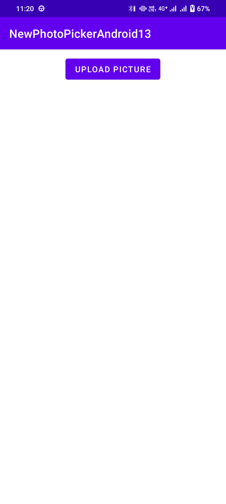
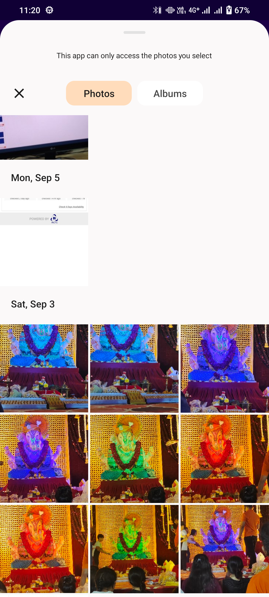

# PhotoPicker

Here is the Demo for the PhotoPicker in All Android Versions

I have added other pickers as well(pdf,doc,video,pictures).

# There is no need to add any kind of permission and any library to select File from gallery .

I have tested with multiple scenarios , here is the scenario list

1. Android 8 to 13 versions
2. Also Add the Single Photo and Multiple Photo Selection
3. Single Photo Selection Working on All Android Versions
4. Multiple Photo Selection will work from Android 11 to Android 13.
5. Multiple Photo Selection below Android 11 we have to use clipdata the old way.

Here how to use library in your project follow below steps .

1. In your gradle(app) add below line
```
    dependencies{
         implementation 'com.github.ParthLotia:FilePicker:Tag'
    }
```   
Replace your Tag with current version 1.0.7 .

2. In your project level gradle add below line
```
    repositories {
        google()
        mavenCentral()
        maven { url "https://www.jitpack.io" }
    }
```

3. Add below code in your activity/fragment
```
    In on create add below lines
    
    btn_upload_pick.setOnClickListener {
            val mimeType = "*/*"
            /*Single Document Picker*/
            // Image , Video , PDF , DOC , DOCX
            pickMedia.launch(
                arrayOf(mimeType)
            )
        }
        
        
    Out side on create add below lines of code
    
        private val pickMedia =
        registerForActivityResult(ActivityResultContracts.OpenDocument()) { uri ->
            if (uri != null) {
                val file = FileUriUtils.getRealPath(this, uri)?.let { File(it) }
                if (FileUriUtils.checkExtensionFile(file)) {
                    img_pick.setImageURI(uri)
                } else {
                    img_pick.setImageBitmap(
                        FileUtil.getThumbnail(
                            file,
                            uri,
                            context = applicationContext
                        )
                    )
                }
            } else {
                Log.d("PhotoPicker", "No media selected")
            }
        }
        
    Here img_pick is an Imageview to display the file you have selected .
```


<!---->

<p align="center">
  
  
  
</p>
